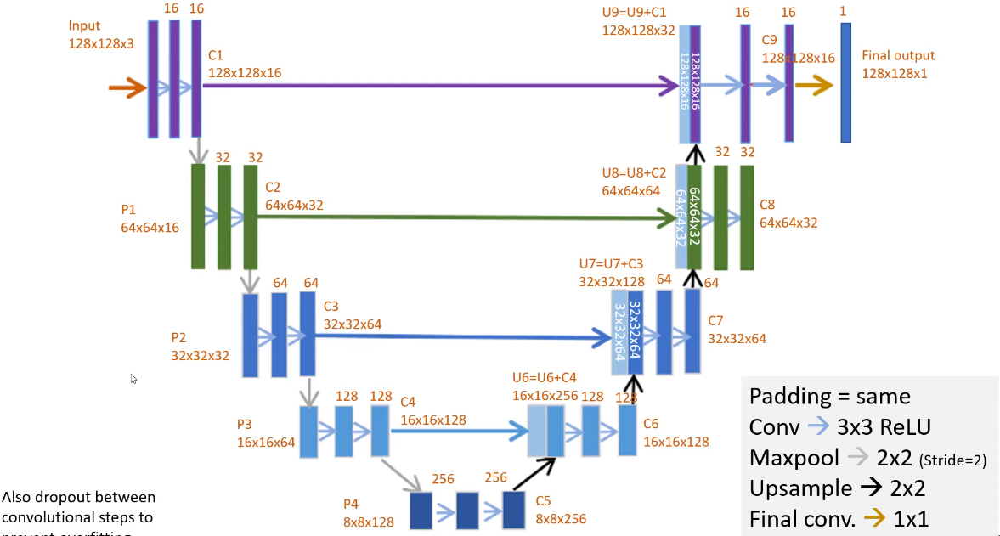
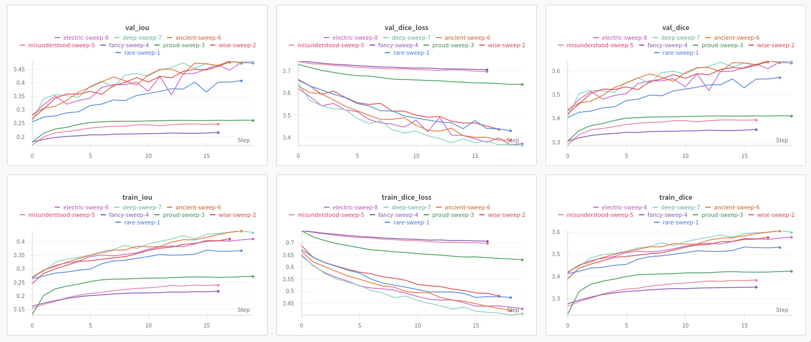
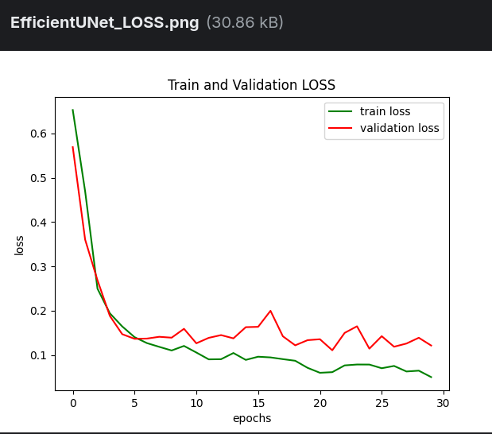
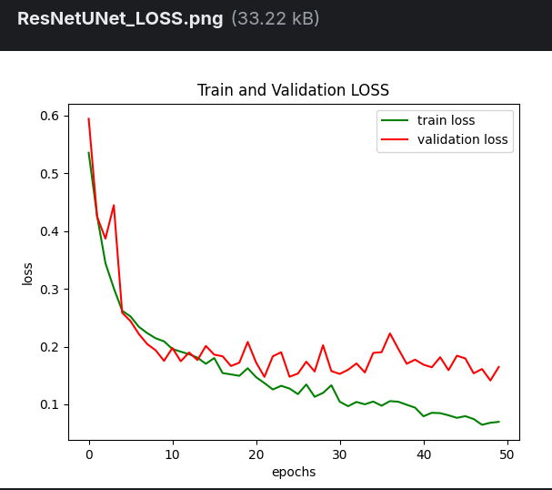
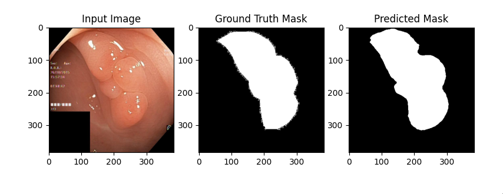
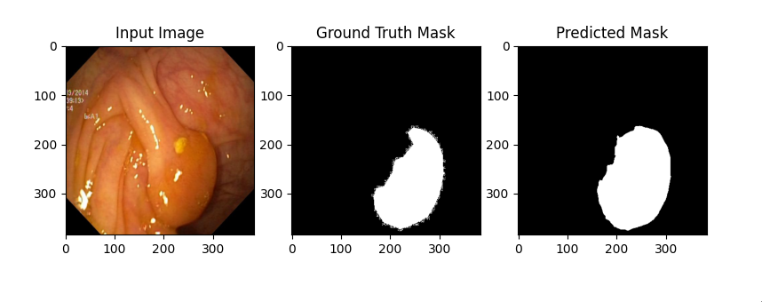

# Medical_AI_Curriculum
[Curriculum](https://amfoss-in.gitbook.io/ai-track/curriculum/medical-ai)

[My Kaggle Notebook](https://www.kaggle.com/code/jatayu000/polyp-segmentation)

## Table of Contents
1. [Installation](#Installation)
2. [Usage](#usage)
3. [Dataset Information](#dataset-information)
4. [Training/Inference Code and Performance Visualization](#traininginference-code-and-performance-visualization)
5. [About the Model](#about-the-model)
5. [Testing Results](#testing--results)


## Installation

### Steps to Install
```sh
git clone <repo-url>
cd <repo-folder>
pip install -r requiremnets.txt
```

## Usage

### Running the Code: Run the main.py in Main directory
```sh
cd Main
python main.py
```

### Folder Structure
```txt
Images/
Kvasir-SEG/
Main/
    consts.py
    data_loader.py
    efficientunet.py
    helpers.py
    main.py
    resnetunet.py
    test.py
    train.py
    unet.py
Models/
```

### File Descriptions
- Main/consts.py: Contains Constants and common parameters
- Main/train.py: Contains the training loop and model evaluation logic.
- Main/test.py: Used for inference and testing the trained models.
- Main/data_loader.py: Handles dataset loading and splitting.
- Main/helpers.py: Contains utility functions like metrics and loss functions.
- Main/unet.py: Implementation of the UNet architecture.
- Main/resnetunet.py: Implementation of the ResNet Encoder UNet architecture.
- Main/efficientunet.py: Implementation of the EfficientNet Encode UNet architecture.

## Dataset Information
The project uses the [Kvasir Segmentation Dataset](), which contains images and masks for polyp segmentation tasks. The dataset is split into training, validation, and testing sets using train_test_split in Main/data_loader.py.

## Training/Inference Code and Performance Visualization
My Approach
I implemented the UNet architecture using PyTorch with modifications to the encoder-decoder structure. The input size was set to 384x384, and I incorporated Batch Normalization and experimented with Dropouts.


WandB Sweeps
I ran hyperparameter sweeps using WandB to optimize:

Resize Image Size (384, 576)
Starting Channel Size
Optimizers (ADAM, SGD, RMSProp)
Batch Sizes
Learning Rates

Performance Visualization


## About the Model
Parameters:
```    
Loss Function: Dice Loss
Optimizer: Adam
Learning Rate: 0.005 (with decay using StepLR)
Batch Size: 8
Unet Starting Channel Size: 32
Resize Image Size: 384
```

## Performance Metrics
For evaluation, I used:
IoU (Intersection over Union): Measures overlap between predicted and ground truth masks.
Dice Coefficient: Measures segmentation accuracy.
Both metrics are implemented in Main/helpers.py.

## Testing & Results
- **EfficientNetUnet-b5:** IOU: 0.778 DICE: 0.876

- **ResNetUNet:** IOU: 0.705 DICE: 0.818

- **UNet:** IOU: 0.622 DICE: 0.755




Here are some outputs of EfficientnetUnet-B5 model:


