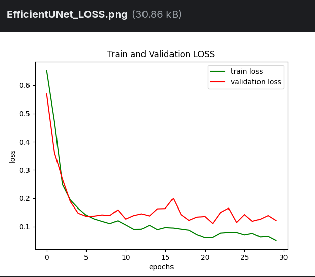
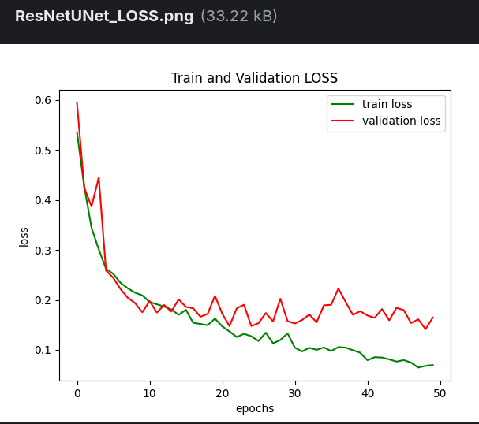

# Medical_AI_Curriculum

[Curriculum](https://amfoss-in.gitbook.io/ai-track/curriculum/medical-ai)

## Dataset

[Kvasir Segmentation Dataset](https://datasets.simula.no/kvasir-seg/)

## My Approach

I chose to build my own implementation of the UNet architecture using **PyTorch**. I referred to the UNet paper and some popular GitHub implementations. I mimicked the encoder-decoder structure with modified channel sizes and used an input size of **384x384** (instead of 128x128 from the original reference). Additionally, I incorporated **Batch Normalization** and experimented with **Dropouts** .

[My Kaggle Notebook](https://www.kaggle.com/code/jatayu000/polyp-segmentation)

###  Augmentations

I used **Albumentations** for data augmentation. The training augmentations include Rotate and HorizontalFlip, followed by Normalization and Resize, 

### Loss & Metrics

I explored several loss functions tailored for segmentation **Binary Cross-Entropy**, **Dice Loss**** and  Combined **BCE + Dice Loss**. But got better results with Dice Loss.

For evaluation, I used Intersection over Union **(IoU) * and **Dice** Coefficient metrics

### Training

Initial training was done for the sake of testing the models ability to learn, how good the **loss function** was doing. Had a problem with **learning rate** since I observed loss getting knocked off and stablising, Hence strted useing Scheduler to add a decay to the learning rate. Then after runing **WandB** sweeps to testing different parts like 
- Resize Image Size (384,576)
- Starting Channel Size (16 in the reference)
- Different Optimisers (ADAM, SGD, RMSProp)
- Batch Sizes
- Starting Learning Rates

The UNET model, and pretrained Models like EfficientNet- b5 and ResNet as Encoder of Unet were the models I tried. The best among these were EfficientNetUnet.

### Testing & Results

**EfficientNetUnet-b5**

`AVG = LOSS: 0.1254  IOU: 0.7781  DICE: 0.8764`

**ResNetUNet**

`AVG = LOSS: 0.1817  IOU: 0.7057  DICE: 0.8188`

**UNet**

`AVG = LOSS: 0.2651  IOU: 0.5932  DICE: 0.7347`